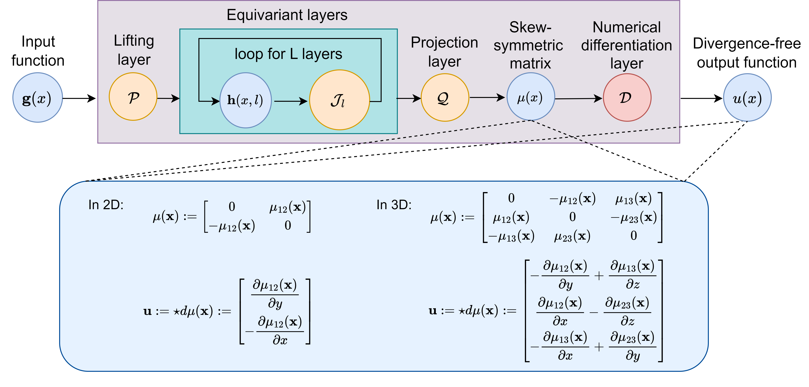

# Harnessing the Power of Neural Operators with Automatically Encoded Conservation Laws

This is the official implementation of clawNO:

Ning Liu, Yiming Fan, Xianyi Zeng, Milan Klöwer, Lu Zhang, Yue Yu. "[Harnessing the Power of Neural Operators with Automatically Encoded Conservation Laws](https://arxiv.org/abs/2312.11176)". [ICML 2024 Spotlight]





## Requirements

To create a `clawNO` `conda` environment, run:

```bash
source setup.sh
```

## Preparing Data

The used datasets in the clawNO paper are available for download [here](https://drive.google.com/drive/folders/1_QLxb5oJchRhavBTpoIETuzdhJuGmw7f?usp=sharing).

* We use [`ns_2d_velocity.py`](data_gen/incompressible_navier_stokes/ns_2d_velocity.py) to generate the incompressible Navier-Stokes data.

* Instructions for generating the radial dam break data from PDEBench are available via the [PDEBench data generation instructions](https://github.com/pdebench/PDEBench).

* The atmospheric modeling dataset can be generated using the general circulation model [SpeedyWeather.jl](https://github.com/SpeedyWeather/SpeedyWeather.jl) with [`datagen_speedyweather.jl`](data_gen/atmospheric_modeling/datagen_speedyweather.jl).

* We use an incompressible material model of the Mooney--Rivlin type to generate constitutive material deformation data. The code requires FEniCS installation and can be run using [`run_Mooney_Rivlin_data_gen.sh`](data_gen/constitutive_material_modeling/run_Mooney_Rivlin_data_gen.sh). After the data is generated, we interpolate the data onto a circular domain using [`interp2domain.m`](data_gen/constitutive_material_modeling/interp2domain.m).

## Running clawNO

Below are commands for training clawNOs on each of the datasets.

Incompressible Navier-Stokes:

```python
python3 experiments_clawNO.py --seed=0 --data_path=./data/ns_data4training_zli_samplefreq2e3_dsfreq4.h5 \ 
	--results_path=./results_ns2d/clawFNO2d/ --strategy=teacher_forcing --T=20 --ntrain=1000 --nvalid=100 --ntest=100 \ 
	--model_type=clawFNO2d --modes=12 --width=20 --batch_size=20 --epochs=100 --suffix=seed0 --txt_suffix=ns_clawFNO2d_seed0 \ 
	--grid=cartesian --learning_rate=1e-3 --early_stopping=100 --verbose

```

Radial Dam Break:

```python
python3 experiments_clawNO.py --seed=0 --data_path=./data/2D_rdb_NA_NA_swe_uvh.h5 --results_path=./results_rdb3d/clawFNO3d/ \ 
	--strategy=oneshot --T=24 --ntrain=800 --nvalid=100 --ntest=100 --model_type=clawFNO3d --modes=8 --width=20 --batch_size=10 \ 
	--epochs=500 --suffix=seed0 --txt_suffix=2D_rdb_NA_NA_uvh.h5_clawFNO3d_symmetric_seed0 --grid=symmetric --learning_rate=1e-2 \ 
	--lmbda=1e-4 --early_stopping=100 --verbose --super

```

Atmospheric Modeling (use experiments_baseline_sw3d.py to run baseline models):

```python
python3 experiments_clawNO_sw3d.py --seed=0 --data_path=./data/sw_6hrs.h5 --results_path=./results_sw3d/clawFNO3d/ \ 
	--strategy=oneshot --T=10 --ntrain=1000 --nvalid=100 --ntest=100 --model_type=clawFNO3d --modes=22 --width=20 \ 
	--batch_size=10 --epochs=500 --suffix=seed0 --txt_suffix=sw3d_clawFNO3d_cartesian_seed0 --grid=cartesian \ 
	--learning_rate=1e-2 --lmbda=1e-4 --early_stopping=500 --verbose --time_pad

```

Constitutive Modeling of Material Deformation:

```python
python3 clawINO_lps_cir.py 100
```

## Citation
```latex
@inproceedings{liu2023harnessing,
author = {Ning Liu, Yiming Fan, Xianyi Zeng, Milan Kl\"{o}wer, Lu Zhang, Yue Yu},
title = {Harnessing the power of neural operators with automatically encoded conservation laws},
booktitle = {Proceedings of the 41th International Conference on Machine Learning},
year = {2024},
}
```

## Acknowledgments
This repository is constructed using the codebase from [G-FNO](https://github.com/divelab/AIRS/tree/main/OpenPDE/G-FNO).
